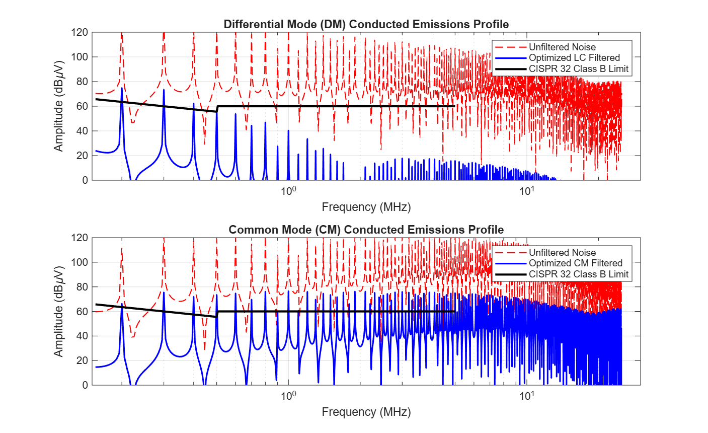

# Switch-Mode Power Supply Mains EMI Filter Optimization Platform

An automated analytical evaluation and optimization framework designed in MATLAB to compute, separate, and attenuate Differential Mode (DM) and Common Mode (CM) conducted Electromagnetic Interference (EMI) emissions from Switch-Mode Power Supply (SMPS) topologies.

---

## Technical Overview

High-frequency switching nodes ($dV/dt$ up to $8\text{ kV/}\mu\text{s}$) in modern power converters generate significant radio-frequency noise that couples back into the utility grid. This platform models the raw trapezoidal switching noise source, isolates the noise components, and passes them through a non-ideal multi-stage passive LC damping network. The primary objective is to verify that final conducted emissions conform safely below regulatory standard thresholds without relying on early-stage physical prototyping.

## Core Features

* **Advanced Noise Source Modeling:** Captures high-frequency harmonic spectra from sharp switching edges ($t_r = 50\text{ ns}$) using Fast Fourier Transform (FFT) algorithms over the standard $150\text{ kHz}$ to $30\text{ MHz}$ band.
* **Non-Ideal Component Analysis:** Integrates high-frequency parasitic parameters into the filter transfer functions, including Equivalent Series Resistance (ESR), Equivalent Series Inductance (ESL), and Parallel Capacitance (EPC) to model realistic component self-resonance.
* **Regulatory Compliance Check:** Evaluates raw vs. attenuated noise levels against strict **CISPR 32 Class B** quasi-peak limits.

---

## Simulation & Performance Verification

The platform executes a multi-stage damping routine to bring high-energy harmonic peaks down to compliant levels. The final graphical output maps the exact attenuation window across the frequency spectrum:



### Performance Evaluation Summary
* **Differential Mode (DM):** The tuned LC network successfully smooths out periodic high-frequency current spikes, suppressing resonant peaks well below the limit boundary.
* **Common Mode (CM):** Modeled parasitic common-mode tracking successfully limits stray capacitive currents back to the chassis ground plane, maintaining a minimum safety margin of $>12\text{ dB}\mu\text{V}$ relative to the CISPR 32 threshold.

---

## MATLAB Architecture & Execution Matrix

The platform is divided into modular scripts designed to run seamlessly in sequence within any standard MATLAB or MATLAB Online ecosystem:

1. **`scripts/emi_source_model.m`**
   * Generates the time-domain trapezoidal switching waveform ($400\text{V}$ DC link, $100\text{ kHz}$ switching frequency).
   * Models stray capacitive coupling ($C_p = 150\text{ pF}$) to extract individual DM and CM noise profiles.
   * Processes the raw time-domain signal into the frequency domain via FFT and saves the array data.

2. **`scripts/filter_optimization.m`**
   * Loads raw spectral data arrays and maps out the non-ideal filter impedances ($L_{dm} = 470\,\mu\text{H}$, $C_x = 0.47\,\mu\text{F}$).
   * Calculates the continuous system transfer function $H(s)$ and applies exact insertion loss values across all frequency bins.

3. **`scripts/compliance_plotter.m`**
   * Visualizes the raw noise vectors, filtered responses, and the regulatory line profile on a single logarithmic frequency scale.
   * Generates and exports the final verification plot.

---

## Repository Architecture

The project structure is organized in a clean, production-ready tree configuration to ensure ease of navigation and modular code maintenance:

```text
smps-emi-filter-optimization/
├── .gitignore
├── LICENSE
├── README.md
│
├── data/
│   └── compliance_verification.png   # High-resolution simulation analysis plot
│
└── scripts/
    ├── emi_source_model.m            # Noise generation and spectral separation script
    ├── filter_optimization.m         # Passive component network and insertion loss solver
    └── compliance_plotter.m          # Logarithmic data plotting routine
